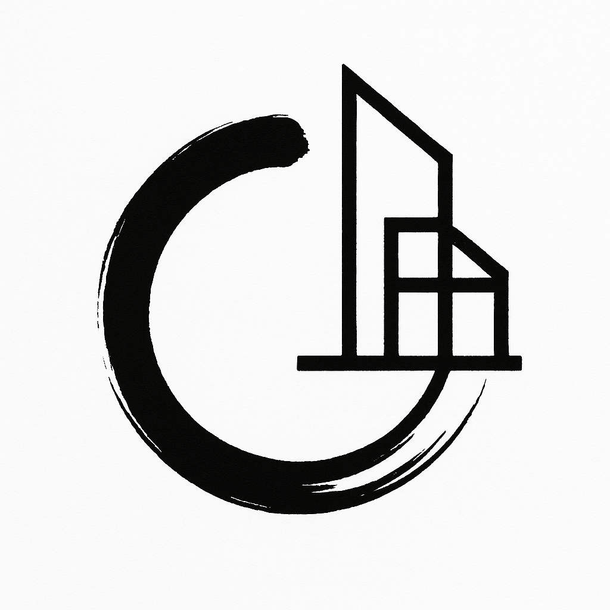

<table style="border:none;">
  <tr>
    <td style="vertical-align:middle; padding-right:16px;">
      
    </td>
    <td style="vertical-align:middle;">
      PER BERGMAN 
      
        Generative Architect — AI • Cloud • Blockchain • Distributed Systems
		Senior Manager, Ernst & Young
       
      
        Santa Fe, NM, USA • Phone +1 505 796 2219 • [nondualist@gmail.com](mailto:nondualist@gmail.com) • [linkedin.com/in/perbergman](https://linkedin.com/in/perbergman) • [github.com/perbergman](https://github.com/perbergman)
      
    </td>
  </tr>
</table>

---

### SUMMARY
Generative Architect with 30+ years designing and delivering complex distributed systems across AI, blockchain, and cloud. Known for extremely fast generative prototyping (**80+ apps in 2025**), deep architectural clarity, and the ability to synthesize multiple domains into elegant, working systems.

Creator with **100+ GitHub repositories** built through a long-term generative engineering practice — spanning AI workflows, distributed systems, blockchain tooling, and rapid 0→1 prototypes.

Operates best in high-ambiguity, high-complexity environments. Expert in AI-assisted development using Claude Code, Cursor, Windsurf, Copilot, and Augment. Designs architectures that integrate ledger systems, cloud-native services, smart contracts, event-driven patterns, and large-scale data flows.

A rare combination of deep systems knowledge, creative intelligence, and rapid 0→1 execution.

---

### VALUE PROPOSITION

I specialize in turning **high-ambiguity, high-stakes technical programs** into **coherent, scalable architectures** that large organizations can actually run. My strength is seeing structure where others see noise — rapidly stabilizing complexity, defining clear patterns, and producing systems that hold together in production at real-world scale.

---

### ARCHITECTURAL THROUGHLINE
Across three decades, my work has followed a single thread:  
**turning complex, ambiguous domains into coherent systems.**

From early telecom and object databases in Sweden → enterprise integration and cloud architectures → decentralized ledgers, identity, and ZKP → to today’s agentic AI and rapid generative prototyping.

Across these eras, one pattern remains constant:  
**seeing structure in noise, moving from insight to architecture quickly, and building systems that hold together under real-world scale.**

This is the core of my practice —  
a blend of engineering depth, pattern recognition, and generative speed that lets new systems emerge fully formed.

---

### CORE CAPABILITIES

- Generative AI–assisted prototyping  
- 0→1 system creation  
- Distributed architecture  
- Blockchain & smart contract design  
- Cloud-native patterns (Azure, AWS)  
- Workflow & data pipelines  
- High-scale systems  
- Technical strategy & executive advisory  
- Emerging tech R&D  
- FinTech, carbon markets, traceability  
- Identity & cryptographic workflows  
- AI developer workflows (LLM-first development)  
 
 
---
 
## EXPERIENCE

### Ernst & Young — Senior Manager, FinTech/Blockchain Tech Lead & Solutions Architect  
**2022–Present**

#### Flagship Project — Public Funds Management: Global Funds Disbursement Tracking (2023–Present)
Solution Architect for global public funds disbursement tracking platform.  
- Designed a **global multi-party transparency and traceability system** used across national institutions and governmental organizations.  
- Architected the core blockchain ledger on **Hyperledger Besu**, with custom Solidity contracts and secure state evolution.  
- Built full Azure cloud architecture: Azure Functions, Service Bus, Storage, Postgres, DevOps, identity and privileged access governance.  
- Integrated **AI and Agentic layers** using Azure AI Foundry, OpenAI, and LLM workflows.  
- Designed identity, access controls, regulatory reporting structures, and event lifecycle models.  
- Provided executive architecture guidance for program governance, technical roadmap, and future-state design.

#### Other EY Blockchain & AI Highlights
- **Canton Network Deployment:**  
  Deployed and configured **Canton validator nodes** (DevNet → TestNet → MainNet) for real transaction flows, including governance setup, networking, operational readiness, and secure environment configuration.  
- Architected carbon offset systems, FinTech transaction flows, and enterprise identity solutions.  
- Built rapid AI-powered prototypes using Claude Code, Cursor, Windsurf, Augment, and Copilot.  

**Technologies:** Azure, Azure AI, Hyperledger Besu, Solidity, DAML, Canton, Ethereum tooling, Postgres, ACA, Azure Functions, Service Bus, DevOps.  

---

### Maxana — Vice President of Innovation  
**2022**
- Designed multi-domain FinTech, payments, and workflow systems.  
- Built marketplaces, payment integrations, and enterprise alerting prototypes.  
- Led demos, pre-sales, and architecture R&D.

**Technologies:** AWS, Python, Java, Go, Kubernetes, Datadog, Prometheus, Camunda Workflow, Stripe APIs.

---

### Ernst & Young (via Zilker acquisition) — Senior Architect  
**2020–2022**
- Architected real-time mobile delivery system with distributed event processing.  
- Led blockchain royalty tracking, DAML carbon-credit PoC for repo loans, and vendor assessments.  
- Delivered mobile, cloud, and distributed workflows across industries.

**Technologies:** Microsoft Quorum, Hyperledger Besu, DAML, Ethereum, Bitcoin, AWS, Android/Kotlin.  

---

### Zilker (acquired by EY) — Senior Architect, Blockchain & Integration  
**2020**
- Designed DAML-based smart contract workflows.  
- Hyperledger Fabric blockchain project for the healthcare industry.  

**Technologies:** DAML, AWS, Hyperledger Fabric, Kafka, HashiCorp Vault, Terraform, Ansible.  

---

### XPANSIV — VP Technology, Innovation Group / Senior Software Architect  
**2018–2020**
Architectural lead for environmental commodity and carbon market platforms.  
- Designed next-generation integrity, provenance, and lifecycle models for global carbon markets.  
- Prototyped distributed ledger workflows and high-integrity commodity-data systems.  
- Designed decentralized identity prototypes using **Hyperledger Aries**, verifiable credentials, and **DIDs**.

**Technologies:** AWS, Node.js, Go, Java, Scala, React, Kafka, Postgres, ledger models, Aries/DID.

---

### Oculus360 — Senior Software Architect  
**2015–2018**
- Architected a high-volume behavioral analytics and ML-integrated search platform.  
- Designed real-time ingestion pipelines for high-velocity behavioral signals.  
- Built low-latency query infrastructure and ML inference integration.

**Technologies:** Java, Python, AWS, Spark, Kafka, Elasticsearch, Redis.

---

### IBM — Consultant (Architecture)  
**2013–2015**
- Enterprise architecture for global cloud and integration programs.  
- Designed early cloud-native reference architectures.  
- Modernized enterprise BPM/SOA platforms.  

**Technologies:** WebSphere BPM, MQ, Java, DB2, Linux, AWS.  

---

### EMC — Consultant  
**2012–2013**
- Systems integration and enterprise consulting across storage and cloud ecosystems.  

**Technologies:** EMC storage, VMware, Linux, Java, Spring Boot.  

---

### Amazon — Software Development Engineer  
**2007–2008**
- Built and maintained distributed systems for global-scale availability.  
- Implemented monitoring, automation, and resilience patterns.  

**Technologies:** Java, Linux, AWS internal toolchain, distributed coordination systems.  

---

### Ascendant — Consultant  
**2008–2012**, **2006–2007**
- Designed and delivered enterprise systems across the **US, Turkey, and the Netherlands**.  
- Led architecture, integration, and cloud-transition initiatives across distributed teams.  

**Technologies:** Java, Spring, SQL, early AWS, integration stacks.

---

### Versant — Consultant  
**2000–2006**
- Developed distributed object database workflows and storage engines.  
- Built transaction coordination, indexing, and object persistence components.  

**Technologies:** C++, Java, ODBMS internals, distributed commit models.  

---

### Early Career — Sweden (Telecom & Distributed Systems)  
**1991–2000**  
Software Engineer and Architect roles across Swedish telecom and early internet companies.  
Work included distributed systems, early object-oriented architectures, and large-scale enterprise platforms across telecom networks and early internet infrastructure.  
Fluent in Swedish; dual US/EU (Sweden) citizenship.  

---

## SIGNATURE PROJECTS

### Zero-Knowledge Proof System (EY)
Designed a full-stack ZKP-based private transaction workflow.  
- Implemented Circom/Groth16 circuits (BN254).  
- Built proof generation, on-chain verification, and encrypted event flows.  
- Designed UTXO-style private state using Pedersen commitments.  

---

### AI-Accelerated Development Pipeline (EY) 
LLM-first SDLC using Claude Code, Cursor, Windsurf, Augment, and Copilot for GitHub. 

---

### Decentralized Identity & Verifiable Credential Prototype (XPANSIV)
Designed a verifiable credential workflow for oil & gas ownership lineage.  
- Implemented multiple **Hyperledger Aries agents** representing real stakeholders.  
- Used **VCs** and **DIDs** to prove relationships (e.g., well ownership → production → operator).  
- Integrated identity proofs with commodity-data provenance models.

---

### Global Carbon Market Traceability Architecture (XPANSIV)
Ledger-backed commodity lifecycle tracking and regulatory-grade provenance --> exchange.

---

### High-Volume Behavioral Analytics Pipeline (Oculus360)
Real-time streaming and ML inference architecture.

---

## TECHNOLOGY STACK

**AI Tools:** Claude Code, Cursor, Windsurf, Augment, Copilot, Azure AI Foundry, Huggingface, ollama, LM Studio, Jupyter, SageMaker  
**Cloud:** Azure Functions, Azure Container Apps, Service Bus, Postgres, Key Vault, AWS (EC2, ECS, Lambda, RDS, SQS, CloudFormation), Kubernetes (AKS, EKS, GKE)  
**Blockchain:** Hyperledger Besu, Solidity, DAML, Canton, Fabric, Aries (DIDs/VCs), ZKP (circuits + verification), Ethereum tooling, EVM internals  
**Languages:** Go, TypeScript, Python, Rust, Java, Scala, Erlang, JavaScript  
**Data & Architecture:** CQRS, event systems, Postgres/JSONB, Redis, Elasticsearch, graph models (Tinkerpop/Neptune), MongoDB, Hadoop  
**DevOps:** GitHub Actions, Azure Pipelines, Terraform, Ansible,
Jenkins, monorepos, CI/CD, observability  

---

## SELECTED TALKS & WRITINGS
- **RAGTime: Neo4j + NVIDIA GPUs on the Cloud** — Medium  
  https://medium.com/@bergman/ragtime-building-a-rag-with-neo4j-and-nvidia-gpus-on-the-cloud-31e11aa03000  
- **Zero-Knowledge Proofs in Practice** — internal presentation and architecture walkthrough  

---

## CERTIFICATIONS
- **DAML Fundamentals, Programming, Architecture** — Digital Asset  
- **AWS Certified Solutions Architect – Associate**  
- **Architecting with Google Kubernetes Engine (GKE)** — Google Cloud  

---

## LECTURES & PRESENTATIONS
- **Agentic AI Architectures** — internal workshops and client advisory  
- **Digital Twins in Telecom** — technical lecture and industry overview  
- **Domain-driven Design (DDD)** — internal workshop  

---

## EDUCATION
**M.Sc. Computer Science — Sweden**

